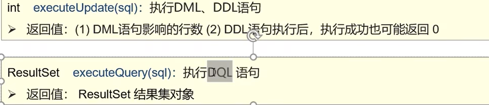

# JDBC

```java
Class.forName("com.mysql.cj.jdbc.Driver"); //可以不写
String url = "jdbc:mysql://127.0.0.1:3306/atguigu"; //jdbc:mysql:///db1?useSSL=false   shu'k
String username = "root";
String password = "zyj2005!";
Connection connection = DriverManager.getConnection(url, username, password);
Statement statement = connection.createStatement();
String sql = "select emp_id,emp_name,emp_salary,emp_age FROM t_emp";
ResultSet resultSet = statement.executeQuery(sql);
while(resultSet.next()){
    System.out.println(resultSet.getInt("emp_id"));
    System.out.println(resultSet.getString("emp_name"));
    System.out.println(resultSet.getString("emp_salary"));
    System.out.println(resultSet.getString("emp_age"));

}
statement.close();
connection.close();
```

## DriverManager

管理一组JDBC程序的基本服务

## Connection

setAutoCommit( true：自动提交/false ：手动提交)

commit（）

rollback（）

## Statement



useServerPreStmts=true

```
Properties prop = new Properties();
prop.load(new FileInputStream(""));
DataSource ds = DruidDataSourceFactory.createDataSource(prop);
Connection conn = ds.getConnection();
String sql = "select * from user";
PreparedStatement ps = conn.prepareStatement(sql);
ResultSet rs = ps.executeQuery();
```